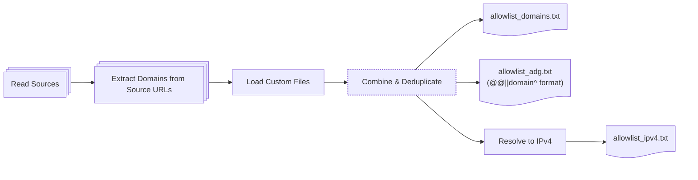

# DNS Toolkit

[](https://github.com/phani-kb/dns-toolkit/actions/workflows/ci.yml)
[](https://goreportcard.com/report/github.com/phani-kb/dns-toolkit)
[](https://codecov.io/gh/phani-kb/dns-toolkit)
[](https://godoc.org/github.com/phani-kb/dns-toolkit)
[](https://www.gnu.org/licenses/gpl-3.0)
[](https://golang.org/doc/go1.24)
[](https://github.com/phani-kb/dns-toolkit/graphs/commit-activity)
[](https://github.com/phani-kb/dns-toolkit)

A command-line utility for downloading, processing, resolving, and consolidating DNS blocklists and allowlists from multiple sources. Performs DNS-to-IP resolution, reverse lookups, and overlap detection. Generates ready-to-use lists for DNS sinkholes, Pi-hole, AdGuard Home, and other network security tools.

## Pipeline Flow


```mermaid
---
config:
  theme: mc
---
flowchart LR
    B["Process<br>via Processors"] --> C["Consolidate<br>Group<br>Categorize<br>Top Entries<br>Overlaps"]
    C --> D["Blocklist/Allowlist Files"] & E["Main README"] & F["Overlap Analysis"] & G["Summary Report"] & H["Statistics Report"] & n2["Format Conversion<br>via Converters"] & n4["Graph Generation<br>via Graphers"]
    D --> I["Archive"]
    E --> I
    F --> I
    H --> I
    G --> I
    n1["Data files"] --> B
    A["Download<br>via Downloaders"] --> n1
    n2 --> n3["Converted Files"]
    n4 --> n5["Graph Images"]
    n3 --> I
    n5 --> I
    B@{ shape: procs}
    C@{ shape: h-cyl}
    D@{ shape: docs}
    n2@{ shape: h-cyl}
    n4@{ shape: paper-tape}
    n1@{ shape: docs}
    n3@{ shape: docs}
    style C stroke-width:4px,stroke-dasharray: 0
    style n2 stroke-width:2px,stroke-dasharray: 2
```

## Published Outputs

**Ready-to-use blocklist files are published daily to the [`output`](https://github.com/phani-kb/dns-toolkit/tree/output) branch:**

- Domain and IP blocklists/allowlists compatible with Pi-hole, pfBlockerNG, AdGuard Home
- Lists organized by size (mini, lite, normal, big) and category (ads, malware, privacy)
- Top entries based on source frequency for high-confidence blocking

**⚡ Quick Usage:** Add `https://raw.githubusercontent.com/phani-kb/dns-toolkit/output/[filename]` to your DNS filtering tool (Pi-hole, AdGuard Home, pfBlockerNG).

Most commonly used outputs; Click any link to open the file.

| Category                                                       | Files (click to open)                                                                                                                                                                                                                                                                                                                                                                                                                                                                                                                                                                                                                                                                                                                                                                                                                                                                                                                                                                                |
|----------------------------------------------------------------|------------------------------------------------------------------------------------------------------------------------------------------------------------------------------------------------------------------------------------------------------------------------------------------------------------------------------------------------------------------------------------------------------------------------------------------------------------------------------------------------------------------------------------------------------------------------------------------------------------------------------------------------------------------------------------------------------------------------------------------------------------------------------------------------------------------------------------------------------------------------------------------------------------------------------------------------------------------------------------------------------|
| 🗂️ Consolidated                                               | 🛑 **Blocklists:** [adguard](https://raw.githubusercontent.com/phani-kb/dns-toolkit/output/adguard_blocklist.txt) · [cidr_ipv4](https://raw.githubusercontent.com/phani-kb/dns-toolkit/output/cidr_ipv4_blocklist.txt) · [domain](https://raw.githubusercontent.com/phani-kb/dns-toolkit/output/domain_blocklist.txt) · [ipv4](https://raw.githubusercontent.com/phani-kb/dns-toolkit/output/ipv4_blocklist.txt) · [ipv6](https://raw.githubusercontent.com/phani-kb/dns-toolkit/output/ipv6_blocklist.txt)  <br>✅ **Allowlists:** [adguard (allowlist)](https://raw.githubusercontent.com/phani-kb/dns-toolkit/output/adguard_allowlist.txt) · [domain (allowlist)](https://raw.githubusercontent.com/phani-kb/dns-toolkit/output/domain_allowlist.txt) · [ipv4 (allowlist)](https://raw.githubusercontent.com/phani-kb/dns-toolkit/output/ipv4_allowlist.txt)                                                               |
| 📏&nbsp;Mini&nbsp;—&nbsp;low&nbsp;false&nbsp;positives&nbsp;🟢 | [mini_adguard](https://raw.githubusercontent.com/phani-kb/dns-toolkit/output/groups/mini_adguard_blocklist.txt), [mini_cidr_ipv4](https://raw.githubusercontent.com/phani-kb/dns-toolkit/output/groups/mini_cidr_ipv4_blocklist.txt), [mini_domain](https://raw.githubusercontent.com/phani-kb/dns-toolkit/output/groups/mini_domain_blocklist.txt), [mini_ipv4](https://raw.githubusercontent.com/phani-kb/dns-toolkit/output/groups/mini_ipv4_blocklist.txt)                                                                                                                                                                                                                                                                                                                                                                                                                                                                               |
| 📏&nbsp;Lite&nbsp;—&nbsp;balanced&nbsp;protection&nbsp;🟡      | [lite_adguard](https://raw.githubusercontent.com/phani-kb/dns-toolkit/output/groups/lite_adguard_blocklist.txt), [lite_cidr_ipv4](https://raw.githubusercontent.com/phani-kb/dns-toolkit/output/groups/lite_cidr_ipv4_blocklist.txt), [lite_domain](https://raw.githubusercontent.com/phani-kb/dns-toolkit/output/groups/lite_domain_blocklist.txt), [lite_ipv4](https://raw.githubusercontent.com/phani-kb/dns-toolkit/output/groups/lite_ipv4_blocklist.txt)                                                                                                                                                                                                                                                                                                                                                                                                                                                                               |
| 📏&nbsp;Normal&nbsp;—&nbsp;broader&nbsp;protection&nbsp;🔵     | [normal_adguard](https://raw.githubusercontent.com/phani-kb/dns-toolkit/output/groups/normal_adguard_blocklist.txt), [normal_cidr_ipv4](https://raw.githubusercontent.com/phani-kb/dns-toolkit/output/groups/normal_cidr_ipv4_blocklist.txt), [normal_domain](https://raw.githubusercontent.com/phani-kb/dns-toolkit/output/groups/normal_domain_blocklist.txt), [normal_ipv4](https://raw.githubusercontent.com/phani-kb/dns-toolkit/output/groups/normal_ipv4_blocklist.txt)                                                                                                                                                                                                                                                                                                                                                                                                                                                               |
| 📏&nbsp;Big&nbsp;—&nbsp;aggressive&nbsp;coverage&nbsp;🔴       | [big_adguard](https://raw.githubusercontent.com/phani-kb/dns-toolkit/output/groups/big_adguard_blocklist.txt), [big_cidr_ipv4](https://raw.githubusercontent.com/phani-kb/dns-toolkit/output/groups/big_cidr_ipv4_blocklist.txt), [big_domain](https://raw.githubusercontent.com/phani-kb/dns-toolkit/output/groups/big_domain_blocklist.txt), [big_ipv4](https://raw.githubusercontent.com/phani-kb/dns-toolkit/output/groups/big_ipv4_blocklist.txt), [big_ipv6](https://raw.githubusercontent.com/phani-kb/dns-toolkit/output/groups/big_ipv6_blocklist.txt)                                                                                                                                                                                                                                                                                                                                                                |
| ⭐ Top lists&nbsp;—&nbsp;min3&nbsp;to&nbsp;min12                | [top_adguard_min3](https://raw.githubusercontent.com/phani-kb/dns-toolkit/output/top/top_adguard_blocklist_min3.txt), [top_adguard_min5](https://raw.githubusercontent.com/phani-kb/dns-toolkit/output/top/top_adguard_blocklist_min5.txt) · [top_domain_min3](https://raw.githubusercontent.com/phani-kb/dns-toolkit/output/top/top_domain_blocklist_min3.txt), [top_domain_min5](https://raw.githubusercontent.com/phani-kb/dns-toolkit/output/top/top_domain_blocklist_min5.txt) · [top_ipv4_min3](https://raw.githubusercontent.com/phani-kb/dns-toolkit/output/top/top_ipv4_blocklist_min3.txt), [top_ipv4_min5](https://raw.githubusercontent.com/phani-kb/dns-toolkit/output/top/top_ipv4_blocklist_min5.txt) (`min3` means "at least 3 sources", `min5` means "at least 5 sources", etc.; higher `minN` → higher confidence, fewer entries.) |

**[View Detailed Overlap Analysis](https://github.com/phani-kb/dns-toolkit/blob/output/overlap.md)** Comprehensive analysis showing how entries are shared across different DNS sources.

**[Conflicts Report (allowlist vs. blocklist)](https://github.com/phani-kb/dns-toolkit/blob/output/conflicts.md)** A daily-generated report listing entries found in both allowlists and blocklists, including the source(s) where they were found.

**Processing summaries and metadata are archived in the [`summaries`](https://github.com/phani-kb/dns-toolkit/tree/summaries) branch with 1-year retention.**

## Quick add (copy-ready URLs)

Copy one of these raw URLs directly into your DNS filtering tool.

### Pi-hole (domain lists)

```text
https://raw.githubusercontent.com/phani-kb/dns-toolkit/output/domain_blocklist.txt
```

### AdGuard Home (AdGuard format)

```text
https://raw.githubusercontent.com/phani-kb/dns-toolkit/output/adguard_blocklist.txt
```

### pfBlockerNG (pfSense)

Use the 'DNSBL' > 'DNSBL Groups' section and add a custom list using the raw URL. Example domain list (paste into pfBlockerNG custom list):

```text
https://raw.githubusercontent.com/phani-kb/dns-toolkit/output/domain_blocklist.txt
```

<!-- BRANCH_SIZES_START -->
## Branch Sizes

**Note:** The repo size badge above only reflects the default branch (`release/1.0.0`).

- **Output branch size:** 349.08 MB
- **Summaries branch size:** 6.02 MB

<!-- BRANCH_SIZES_END -->

<!-- STATS_START -->
## Source Statistics

*Automatically generated statistics from source configuration files*

| Metric | Count | Details |
|--------|-------|---------|
| **Total&nbsp;Sources** | 182 | 152 enabled, 30 disabled |
| **Blocklist&nbsp;Sources** | 154 | Sources providing blocking rules |
| **Allowlist&nbsp;Sources** | 39 | Sources providing exception rules |
| **Categories** | 40 | ads, adult, ai, annoyance, anonymizer, botnet, browser, cryptocurrency, dating, discord, dns, doh, fake, fakenews, finance, gambling, issues, kad, local, mac, malicious, malware, mobile, others, phishing, privacy, proxy, ransomware, scam, smarttv, social, spam, spyware, threat, topdomains, tor, torrent_trackers, trackers, url_shorteners, windows |
| **Source&nbsp;Types** | 30 | adguard, adguard_csv_http_url_find, adguard_domain, adguard_http_url, cidr_ipv4, domain, domain_adguard, domain_comment, domain_csv_http_url_find, domain_custom_csv_blackbook, domain_custom_csv_maltrail, domain_custom_html_ccam, domain_custom_html_puppyscams, domain_http_url, domain_top, domain_url, domain_with_comment_suffix, hostname, ipv4, ipv4_cidr_expand, ipv4_csv_http_url_find, ipv4_custom_html_ccam, ipv4_find, ipv4_from_domain, ipv4_http_url, ipv4_range_expand, ipv4_url, ipv6, ipv6_find, ipv6_htaccess |
| **Geographic&nbsp;Coverage** | 21 countries | CN, CZ, DE, ES, FI, FR, HU, ID, IL, IT, KR, LV, MY, NL, RO, RU, SA, SK, UA, US, VN |
| **Last&nbsp;Updated** | 2026-01-19 20:08:13 UTC | Statistics generation time |

<!-- STATS_END -->

<!-- CREDITS_START -->
## Credits

This project is made possible by the following blocklist and allowlist sources:

Legend: S = Status, C/U/X = Count / Unique / Conflicts

<details>
<summary><strong>📄 sources_domain_al.json</strong> (19 sources)</summary>

| Name | S | Categories |         C / U / X        | Notes |
|------|---|------------|--------------------------|-------|
| AdGuardSDNSFilter_exclusions | ✅ | others | - | - |
| AdGuardTeam_HttpsExclusions_android | ✅ | mobile | 97 / 65 / 20 | - |
| AdGuardTeam_HttpsExclusions_banks | ✅ | finance | 3976 / 3935 / 22 | - |
| AdGuardTeam_HttpsExclusions_firefox | ✅ | browser | 18 / 13 / 0 | - |
| AdGuardTeam_HttpsExclusions_issues | ✅ | issues | 68 / 61 / 3 | - |
| AdGuardTeam_HttpsExclusions_mac | ✅ | mac | 11 / 4 / 1 | - |
| AdGuardTeam_HttpsExclusions_sensitive | ✅ | others | 177 / 148 / 14 | - |
| AdGuardTeam_HttpsExclusions_windows | ✅ | windows | 7 / 6 / 0 | - |
| anudeepND_Allowlist | ❌ | others | - | Last updated on 2021-12-01. This list is no longer maintained. |
| BlahDNS_whitelist | ❌ | others | - | Too many conflicts with other sources |
| China_CDN_Whitelist | ❌ | others | - | - |
| DandelionSprout_AdGuardHome_Whitelist | ✅ | others | 285 / 40 / 0 | - |
| Dogino_Discord_Official | ✅ | discord | 43 / 0 / 14 | - |
| fabriziosalmi_allowlist | ✅ | others | 2268 / 865 / 992 | - |
| Freekers_Whitelist | ❌ | others | - | No update since 2019 |
| Notracking_Hosts_whitelist | ❌ | others | - | Archived by the owner on Aug 8, 2023 |
| ShadowWhisperer_Allowlist | ✅ | others | 689 / 270 / 326 | - |
| T145_allowlist-domains | ❌ | others | - | Huge list, use with caution |
| TogoFire_AD_Settings_whitelist | ✅ | others | 1764 / 1519 / 0 | Huge list, use with caution |

</details>

<details>
<summary><strong>📄 sources_domain_bl.json</strong> (107 sources)</summary>

| Name | S | Categories |         C / U / X        | Notes |
|------|---|------------|--------------------------|-------|
| 1Hosts (Lite) | ✅ | ads, trackers | 210892 / 0 / 187 | - |
| abpvn_hosts | ✅ | ads | 1128 / 1024 / 0 | - |
| Adaway | ✅ | ads | 6540 / 0 / 105 | >99% overlap with StevenBlack Fake Gambling list |
| AdBlockID | ✅ | ads | 87 / 36 / 50 | - |
| AdGuard Base filter | ✅ | ads, trackers | 112420 / 0 / 0 | - |
| AdGuard CNAME Mail Trackers | ✅ | trackers | 33401 / 32862 / 0 | - |
| AdGuard CNAME Trackers | ✅ | trackers | 62703 / 35233 / 10 | - |
| AdGuard DNS filter | ✅ | ads, trackers | 195 / 0 / 225598 | - |
| AdGuard Spyware Filter - Mobile | ✅ | ads, mobile, spyware | 1218 / 0 / 0 | - |
| AntiAdBlockFilters | ✅ | annoyance | 1705 / 1697 / 0 | - |
| anudeepND_adservers | ❌ | ads | - | No update since 2023-01-16 |
| bigdargon_hostsVN | ✅ | ads | 17334 / 0 / 142 | - |
| Blocklists UT1 Cryptojacking | ✅ | cryptocurrency | 16288 / 14976 / 8 | - |
| Blocklists UT1 Malware | ✅ | malware | 248679 / 0 / 6 | >80% overlap with phishing_army |
| Blocklists UT1 Publicite | ✅ | ads | 4270 / 0 / 126 | 100% covered by other sources |
| Blocklists UT1 Shortener | ✅ | url_shorteners | 4538 / 0 / 21 | - |
| Boutetnico_URL_Shorteners | ✅ | url_shorteners | 418 / 211 / 24 | - |
| Cameleon | ❌ | ads | - | No update since 2018-03-17 |
| CF_Torrent_Trackers | ✅ | torrent_trackers | 112 / 0 / 0 | - |
| CJX Annoyance | ✅ | annoyance | 1807 / 1713 / 0 | - |
| CybercrimeTracker_All | ❌ | botnet, malicious, malware | - | Redirect loops may occur; website unavailable since 2025-10-27 |
| CybercrimeTracker_CCAM | ❌ | botnet, malicious, malware | - | No regular updates |
| CybercrimeTracker_CCPMGate | ❌ | botnet, malicious, malware | - | Redirect loops may occur; website unavailable since 2025-10-27 |
| cyberhost_malware-blocklist | ✅ | malware | 19929 / 975 / 3 | - |
| Dan Pollock's List | ✅ | ads, malware, trackers | 11851 / 0 / 31 | >95% overlap with StevenBlack Fake Gambling list |
| DandelionSprout-Anti-Malware-List | ✅ | malware | 16729 / 16717 / 0 | - |
| Easy Privacy | ✅ | privacy, trackers | 54028 / 22315 / 1 | - |
| EasyList | ✅ | ads | 67698 / 0 / 0 | 100% covered by other sources |
| fabriziosalmi_blocklists | ❌ | malicious, threat | - | Huge list, >3 million entries |
| FadeMind_2o7Net | ❌ | ads, privacy, trackers | - | No update since 2023-11-30 |
| FakeWebshopListHUN | ✅ | fake, phishing, scam, threat | - | - |
| Frogeye-firstparty-trackers | ✅ | trackers | 32120 / 15415 / 12 | - |
| GetAdmiral Domains Filter List | ✅ | ads, annoyance | 1753 / 0 / 0 | - |
| GlobalAntiScamOrg-blocklist-domains | ✅ | scam | 11186 / 6500 / 2 | - |
| HaGeZi Amazon Tracker | ✅ | privacy, trackers | 621 / 0 / 34 | >98% overlap with HaGeZi Pro |
| HaGeZi Apple Tracker | ✅ | privacy, trackers | 105 / 0 / 8 | >80% overlap with HaGeZi Pro |
| HaGeZi DNS TIF Mini | ✅ | malicious, threat | 115042 / 36349 / 2 | 100% covered by other sources |
| HaGeZi Encrypted DNS Servers | ✅ | doh | 3469 / 2299 / 9 | - |
| HaGeZi Gambling Only Domains | ✅ | gambling | 183208 / 175153 / 6 | Huge list and gambling-specific focus |
| HaGeZi Microsoft Tracker | ✅ | privacy, trackers | 3483 / 0 / 12 | >75% overlap with HaGeZi Pro |
| HaGeZi Most Abused TLDs | ✅ | spam | 435 / 433 / 0 | - |
| HaGeZi Normal | ❌ | ads, malware, trackers | - | 100% overlap with HaGeZi Pro |
| HaGeZi Pro | ✅ | ads, malware, phishing, trackers | 337654 / 0 / 180 | - |
| HaGeZi Xiaomi Tracker | ✅ | privacy, trackers | 463 / 0 / 0 | >95% overlap with HaGeZi Pro |
| Hestat_Minerchk | ❌ | cryptocurrency | - | No update since 2018 |
| hkamran80_smarttv | ✅ | smarttv | 294 / 0 / 14 | - |
| Hostsfile | ❌ | ads | - | No update since 2018-04-20 |
| hufilter | ✅ | ads | 101 / 0 / 3 | >90% overlap with HaGeZi Pro |
| iam-py-test_my-filters-001-antitypo | ✅ | fake | 825 / 824 / 0 | - |
| jarelllama_Scam-Blocklist | ✅ | scam | 468729 / 427834 / 11 | Disabled due to very large size (457K entries) - scam-specific focus |
| kadantiscam | ✅ | kad | 35886 / 0 / 1 | peer-to-peer network protocol |
| Korlabs_UrlShortener | ✅ | url_shorteners | 237 / 0 / 17 | - |
| lightswitch05 | ❌ | ads, trackers | - | Archived on 2024-06-17 |
| Malicious URL Blocklist (URLHaus) | ✅ | ads | 11105 / 0 / 0 | 100% covered by other sources |
| Maltrail_StaticTrails | ✅ | malware, threat | 216590 / 189766 / 5 | - |
| malware-filter_phishing-filter | ✅ | malware, phishing | 20272 / 0 / 1 | - |
| OISD Blocklist Big | ✅ | ads, cryptocurrency, malware, phishing, ransomware, trackers | 210450 / 0 / 76 | Huge list |
| OISD Blocklist NSFW Small | ✅ | adult | 16234 / 0 / 14 | - |
| OISD Blocklist Small | ✅ | ads, cryptocurrency, malware, phishing, ransomware, trackers | 49160 / 0 / 53 | - |
| OpenPhish_Feed | ✅ | phishing | 268 / 0 / 0 | - |
| Peter Lowe's Blocklist | ❌ | ads | - | 100% covered by other sources, same as yoyo adservers list |
| pexcn Torrent Trackers | ✅ | torrent_trackers | 81 / 0 / 0 | - |
| ph00lt0_blocklist | ✅ | ads, trackers | 22506 / 0 / 477 | 100% covered by other sources, ~50 ip addresses in domain list |
| phishing_army | ✅ | phishing | 150577 / 0 / 1 | - |
| Policeman_SimpleDomainsBlocklist | ❌ | malicious | - | Archived on 2021-12-26 |
| PuppyScams | ✅ | fake, scam | 102 / 92 / 0 | List of top 100 pet scams is not being shared anymore, https://puppyscams.org/top-100-pet-scams |
| quidsup_notrack-annoyance | ✅ | annoyance | 457 / 0 / 1 | >90% overlap with HaGeZi Pro |
| quidsup_notrack-malware | ✅ | malware | 141 / 0 / 0 | - |
| quidsup_notrack-tracker | ✅ | trackers | 15602 / 0 / 158 | - |
| RedDragonWebDesign_block-everything | ✅ | ads, malicious, trackers | 665 / 661 / 0 | - |
| RPiList_specials-malware | ✅ | malware | 422335 / 208823 / 0 | Huge list |
| RPiList_specials-phishing | ✅ | phishing | 154305 / 0 / 0 | Huge list |
| ShadowWhisperer's Dating List | ✅ | dating | 1309 / 1120 / 0 | - |
| ShadowWhisperer_BlockLists Ads | ✅ | ads | 25736 / 0 / 79 | - |
| ShadowWhisperer_BlockLists Adult | ✅ | adult | 236112 / 178311 / 14 | Huge list and adult-specific focus |
| ShadowWhisperer_BlockLists Malware | ✅ | malware | 42344 / 0 / 4 | - |
| ShadowWhisperer_BlockLists Scam | ✅ | scam | 7208 / 4884 / 0 | - |
| ShadowWhisperer_UrlShortener | ✅ | url_shorteners | 5754 / 1255 / 2 | - |
| Sinfonietta_Adult | ✅ | adult | 60944 / 0 / 18 | - |
| Sinfonietta_Gambling | ✅ | gambling | 2639 / 0 / 1 | - |
| Sinfonietta_Social | ✅ | social | 3243 / 0 / 106 | - |
| Spam404 | ✅ | spam | 8140 / 5992 / 1 | - |
| Stamparm_Blackbook | ✅ | malicious, threat | 18145 / 0 / 0 | >95% overlap with Blocklists UT1 Malware |
| StevenBlack_Adhoc_list | ❌ | ads, malware, trackers | - | 100% overlap with StevenBlack Fake Gambling list |
| StevenBlack_Fake_Gambling | ✅ | ads, fake, fakenews, gambling | 76797 / 0 / 206 | - |
| StevenBlack_Porn | ✅ | adult | 76503 / 0 / 23 | - |
| StevenBlack_Social | ✅ | social | 3243 / 0 / 106 | - |
| T145_black-mirror | ❌ | malicious, threat | - | Huge list, >8 million entries |
| ThreatFox_Hostfile | ✅ | malware, threat | 45014 / 0 / 0 | - |
| ThreatView_Domain_High-Confidence | ✅ | malware, phishing, threat | 2471 / 2353 / 0 | Huge list, when compared to IPv4 feed from the same source |
| Torrent Trackers | ✅ | torrent_trackers | 555 / 335 / 0 | - |
| Ukrainian Ad Filter | ✅ | ads | 1459 / 1253 / 0 | - |
| Ukrainian Annoyance Filter | ✅ | annoyance | - | - |
| Ukrainian Privacy Filter | ✅ | privacy, trackers | 366 / 30 / 1 | - |
| Ukrainian Security Filter | ✅ | malicious, threat | 1736 / 1168 / 0 | - |
| UncheckyAds | ❌ | ads, privacy, trackers | - | No update since 2021 |
| URLHaus (Abuse.ch) | ✅ | malware | 497 / 0 / 0 | - |
| USOM-Blocklists-domains | ✅ | malicious, threat | 434623 / 378470 / 18 | Huge list |
| Viriback_Dump | ✅ | malware | 4852 / 268 / 0 | - |
| WaLLy3K | ✅ | ads | 350 / 0 / 12 | - |
| Warui_Adhosts | ✅ | ads | 75777 / 0 / 238 | Huge list |
| WindowsSpyBlocker_Hosts_spy | ❌ | privacy, trackers | - | No update since 2022-05-16 |
| Winhelp2002 | ❌ | ads | - | No update since 2021-03-06 |
| YousList | ✅ | ads | 624 / 0 / 3 | - |
| YousList-AdGuard | ✅ | ads | 7375 / 7196 / 0 | - |
| youtube_GoodbyeAds | ✅ | ads | 97645 / 97112 / 15 | No update since 2024-11-21 |
| Yoyo Adservers-Hosts | ✅ | ads | 3499 / 0 / 95 | >95% overlap with StevenBlack Fake Gambling list |

</details>

<details>
<summary><strong>📄 sources_domain_new.json</strong> (1 sources)</summary>

| Name | S | Categories |         C / U / X        | Notes |
|------|---|------------|--------------------------|-------|
| nrd-14day-mini | ❌ | others | - | Huge list with low unique contribution |

</details>

<details>
<summary><strong>📄 sources_domain_top.json</strong> (1 sources)</summary>

| Name | S | Categories |         C / U / X        | Notes |
|------|---|------------|--------------------------|-------|
| tranco | ✅ | topdomains | 1000 / 0 / 1340 | - |

</details>

<details>
<summary><strong>📄 sources_ip.json</strong> (43 sources)</summary>

| Name | S | Categories |         C / U / X        | Notes |
|------|---|------------|--------------------------|-------|
| AlienVault_Reputation | ❌ | malicious, threat | - | Not available anymore. The service has been discontinued. |
| BinaryDefense_Banlist | ✅ | malicious, threat | 1843 / 0 / 0 | This is for public use only. |
| Blackhole_Today | ❌ | malicious, threat | - | Download fails frequently due to network instability or potential blocking. |
| BlockListDE_Brute | ✅ | threat | 3584 / 0 / 0 | >95% overlap with Firehol_level2 |
| BlockListDE_Strong | ✅ | malicious, threat | 282 / 0 / 0 | >95% overlap with Borestad_AbuseIPDB_S100_3d |
| Borestad_AbuseIPDB_S100_3d | ✅ | malicious, threat | 67240 / 0 / 0 | - |
| BruteforceBlocker | ✅ | threat | 538 / 0 / 0 | >95% overlap with EmergingThreats_CompromisedIPs |
| CINSScore_BadGuys_Army | ✅ | malicious, threat | 15000 / 0 / 0 | - |
| DanMeUK_TorExitNodes | ✅ | tor | 1457 / 223 / 0 | - |
| DoH_IP_blocklists | ✅ | doh | 2533 / 705 / 2 | >90% overlap with HaGeZi Encrypted DNS Servers |
| DoH_IP_list | ✅ | doh | 731 / 0 / 0 | - |
| DShield | ✅ | malicious, threat | 5120 / 0 / 0 | 100% overlap with Firehol_level2/Firehol_level3 |
| EmergingThreats_CompromisedIPs | ✅ | malicious, threat | 536 / 0 / 0 | >95% overlap with Firehol_level3,  and Borestad_AbuseIPDB_S100_3d |
| ET_fwip | ✅ | malicious, threat | 1464 / 122 / 0 | - |
| FabrizioSalmi_DNS | ✅ | dns | 66 / 0 / 0 | - |
| Firehol_abusers_30d | ❌ | malicious, threat | - | False positives are common, use with caution. |
| Firehol_BitcoinNodes_1d | ✅ | cryptocurrency | 7964 / 7883 / 0 | - |
| Firehol_Botscout_1d | ✅ | malicious, threat | 468 / 363 / 0 | - |
| Firehol_CleanTalk | ✅ | malicious, threat | 494 / 461 / 0 | - |
| Firehol_CleanTalk_Top20 | ✅ | malicious, threat | 20 / 4 / 0 | - |
| Firehol_GPF_Comics | ✅ | malicious, threat | 2652 / 1944 / 0 | - |
| Firehol_level1 | ✅ | malicious, threat | 4477 / 3135 / 0 | - |
| Firehol_level2 | ✅ | malicious, threat | 16970 / 0 / 0 | - |
| Firehol_level3 | ✅ | malicious, threat | 12933 / 0 / 3 | - |
| Firehol_SocksProxy_7d | ✅ | anonymizer, privacy, proxy | 1736 / 1401 / 0 | - |
| Firehol_SSLProxies_1d | ✅ | anonymizer, privacy, proxy | 169 / 137 / 0 | - |
| GlobalAntiScamOrg-blocklist-ips | ✅ | scam | - | - |
| Greensnow | ✅ | malicious, malware, threat | 5565 / 0 / 0 | >95% overlap with Firehol_level2 |
| HaGeZi_DoH | ✅ | doh | 1658 / 0 / 0 | >90% overlap with DoH_IP_blocklists |
| HaGeZi_TIF | ✅ | malicious, threat | 44808 / 0 / 0 | No unique contribution |
| MyIP_MS_Blocklist | ✅ | malicious, threat | - | - |
| Public_DNS4 | ✅ | dns | 62607 / 61689 / 0 | - |
| Rutgers_DROP | ✅ | malicious, threat | 2074 / 0 / 0 | - |
| Sblam_Blocklist | ✅ | spam | 1196 / 576 / 0 | - |
| ScriptzTeam_BadIPS | ✅ | malicious, threat | 2567 / 1425 / 0 | - |
| Sentinel_Greylist | ✅ | malicious, threat | 9084 / 0 / 4 | - |
| spamhaus_drop | ✅ | spam, threat | - | - |
| T145_allowlist-ips | ❌ | others | - | Huge list, use with caution. More than its blocklist counterpart. |
| T145_blocklist | ❌ | malicious, malware, threat | - | Huge list, use with caution. |
| ThreatView_IP_HighConfidence | ✅ | malicious, phishing, threat | 6831 / 0 / 0 | - |
| URLHaus_Text | ✅ | malware | 20816 / 0 / 0 | - |
| USOM-Blocklists-ips | ✅ | malicious, threat | 13676 / 7802 / 0 | - |
| Yoyo AdServers-IPList | ✅ | ads | 8915 / 8864 / 0 | - |

</details>

<details>
<summary><strong>📄 sources_local.json</strong> (7 sources)</summary>

| Name | S | Categories |         C / U / X        | Notes |
|------|---|------------|--------------------------|-------|
| local_adg_allowlist | ✅ | local | - | - |
| local_adg_blocklist | ✅ | local | 7 / 0 / 0 | - |
| local_ai_allowlist | ✅ | ai | 50 / 0 / 52 | - |
| local_ai_blocklist | ✅ | ai | 50 / 0 / 50 | - |
| local_domain_blocklist | ✅ | local | 7 / 0 / 1 | - |
| local_source_domain_allowlist | ✅ | local | 45 / 26 / 0 | - |
| local_source_ipv4_allowlist | ✅ | local | 51 / 42 / 9 | - |

</details>

<details>
<summary><strong>📄 sources_local_category.json</strong> (3 sources)</summary>

| Name | S | Categories |         C / U / X        | Notes |
|------|---|------------|--------------------------|-------|
| local_miscellaneous_allowlist | ✅ | local | 7 / 0 / 11 | - |
| local_mobile_allowlist | ✅ | local, mobile | 4 / 1 / 3 | - |
| local_social_allowlist | ✅ | local, social | 1 / 0 / 2 | - |

</details>

<details>
<summary><strong>📄 sources_mis.json</strong> (1 sources)</summary>

| Name | S | Categories |         C / U / X        | Notes |
|------|---|------------|--------------------------|-------|
| VXVault_URLList | ✅ | malware | 38 / 0 / 0 | >95% overlap with Firehol_level3 |

</details>

<!-- CREDITS_END -->

## Source Configuration (Important!)

Sources are configured in `data/config/sources*.json` files. Each source specifies:

- Download URL and frequency
- Source type (domain, IPv4, IPv6, AdGuard, etc.)
- Categories (ads, malware, privacy, etc.)
- License and website information

## Special Note on Top Domains (tranco-list.eu)

Top domains sourced from the tranco-list.eu list (`domain_top` type) are treated as an allowlist.
## Allowlist Generation Flow


```mermaid
---
config:
  theme: mc
---
flowchart LR
 subgraph horizontal[" "]
    direction LR
        OutputIPv4["allowlist_ipv4.txt"]
  end
    ReadSources["Read Sources"] --> ExtractDomains["Extract Domains from Source URLs"]
    ExtractDomains --> LoadCustom["Load Custom Files"]
    LoadCustom --> Combine["Combine & Deduplicate"]
    Combine --> OutputDomains["allowlist_domains.txt"] & OutputAdGuard["allowlist_adg.txt<br>(@@||domain^ format)"] & ResolveDNS["Resolve to IPv4"]
    ResolveDNS --> OutputIPv4

    OutputIPv4@{ shape: doc}
    ReadSources@{ shape: procs}
    ExtractDomains@{ shape: procs}
    OutputDomains@{ shape: doc}
    OutputAdGuard@{ shape: doc}
    ResolveDNS@{ shape: proc}
    style Combine stroke-width:2px,stroke-dasharray: 2
    style horizontal fill:transparent,stroke:transparent

```

## Installation

```bash
git clone https://github.com/phani-kb/dns-toolkit.git
cd dns-toolkit
go build -o bin/dns-toolkit main.go
```

## Quick Start

```bash
# Download and process all sources
dns-toolkit download
dns-toolkit process
dns-toolkit consolidate
dns-toolkit generate output

# Search for a domain
dns-toolkit search example.com

# Analyze overlaps between sources
dns-toolkit overlap

# Find top entries across sources
dns-toolkit top
```

## Key Commands

```text
DNS Toolkit

Usage:
  dns-toolkit [command]

Available Commands:
  archive          Archive DNS toolkit data
  consolidate      Consolidate processed files
  download         Download enabled sources
  generate         Generate different types of outputs
  help             Help about any command
  overlap          Find overlap between source files
  process          Process downloaded files
  search           Search for a domain or IP in the processed files
  sts              Prints the source types summary
  top              Find top entry(s) in each generic source type
  validate-sources Validate the sources configuration
  version          Print the version number of DNS Toolkit

Flags:
  -h, --help   help for dns-toolkit

Use "dns-toolkit [command] --help" for more information about a command.
```

## Output Structure

```text
data/output/
├── *_blocklist.txt    # Blocklists for various source types (adguard, domain, ipv4, ipv6, cidr)
├── *_allowlist.txt    # Allowlists for various source types (adguard, domain, etc.)
├── categories/        # Lists by category (ads, malware, privacy, etc.)
├── groups/            # Lists by size (mini, lite, normal, big)
├── top/               # Top entries based on source frequency
└── summaries/         # Processing metadata and statistics
```

## Contributing

1. Fork the repository
2. Create a feature branch
3. Make your changes
4. Submit a pull request

## Issues

If you encounter a bug, have a feature request, or want to suggest an improvement, please open an issue on the [GitHub Issues](https://github.com/phani-kb/dns-toolkit/issues) page.

## License

This project is licensed under the terms specified in the LICENSE file.
